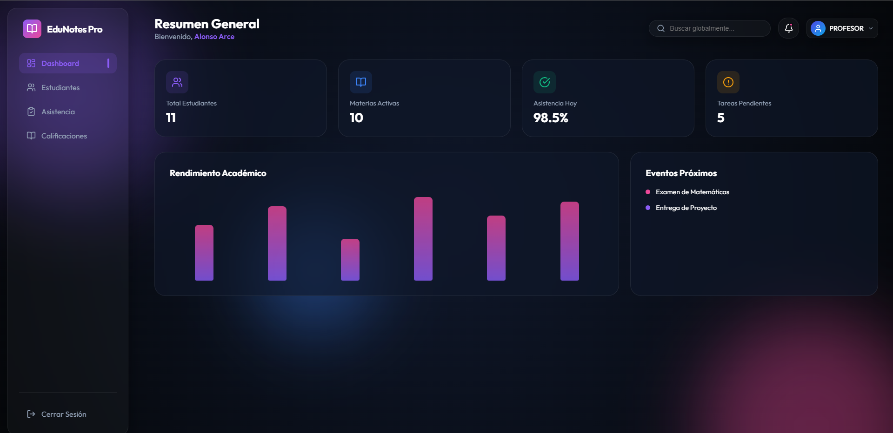
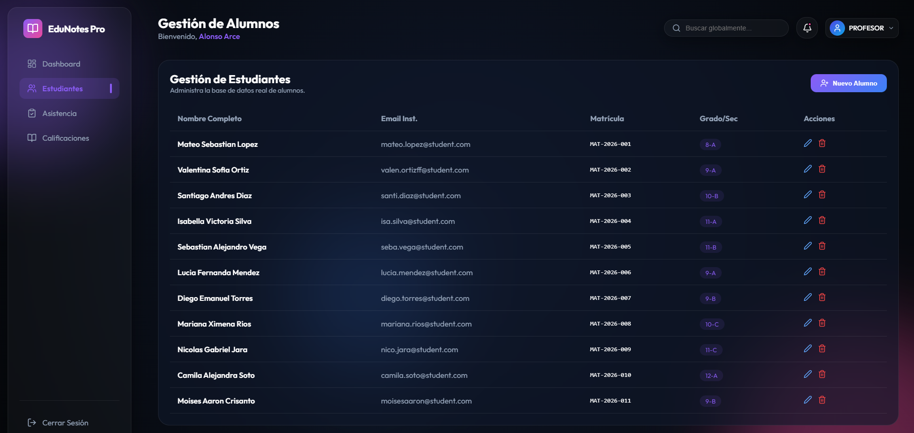
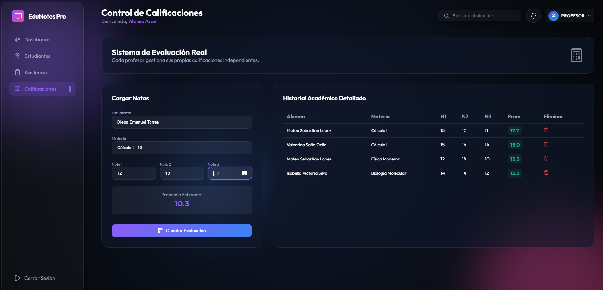

# EduNotes Pro - Sistema de Gestión Académica Integral 🎓


**EduNotes Pro** es una plataforma de gestión escolar de última generación diseñada para digitalizar y optimizar procesos académicos. Con una interfaz ultra-moderna basada en *Glassmorphism* y una arquitectura robusta, permite a instituciones educativas gestionar estudiantes, asistencias y calificaciones con un enfoque de privacidad y aislamiento de datos por docente.

---

## 🚀 Características Principales

### 👨‍🏫 Gestión para Profesores
- **Control de Asistencia Real**: Registro diario de presencia, tardanza o ausencia filtrado por materia y sección.
- **Evaluación Triple**: Sistema de calificación basado en tres notas (N1, N2, N3) con cálculo automático de promedio ponderado en tiempo real.
- **Aislamiento de Datos**: Cada profesor gestiona exclusivamente sus materias y estudiantes, garantizando la integridad y privacidad de la información académica.

### 👤 Perfil y Seguridad
- **Autenticación JWT**: Sistema de seguridad basado en tokens para sesiones seguras.
- **Roles Definidos**: Diferenciación de acceso entre Administradores y Profesores.
- **Gestión de Perfil**: Panel personalizable para actualizar información del docente.

### 📊 Experiencia de Usuario (UX/UI)
- **Diseño Premium**: Interfaz basada en Glassmorphism con modo oscuro y acentos vibrantes.
- **Micro-animaciones**: Transiciones fluidas utilizando Framer Motion para una experiencia interactiva superior.
- **Dashboard Dinámico**: Resumen estadístico en tiempo real del estado académico.

---

## 🛠️ Stack Tecnológico

### Backend
- **Java 17 / Spring Boot 3**: Framework central.
- **Spring Security + JWT**: Control de acceso y seguridad.
- **Spring Data JPA**: Abstracción de base de datos.
- **MySQL**: Motor de base de datos relacional.
- **Lombok**: Reducción de código boilerplate.

### Frontend
- **React 19 / Vite**: Biblioteca de UI de alta performance.
- **Framer Motion**: Motor de animaciones.
- **Lucide React**: Set de iconos modernos de trazo fino.
- **Axios**: Cliente HTTP para integración con la API.
- **Vanilla CSS**: Estilizado personalizado para máxima flexibilidad.

---

## 📦 Instalación y Configuración

### 1. Base de Datos
Crea una base de datos en MySQL llamada `notas_asistencia`:
```sql
CREATE DATABASE notas_asistencia;
```

### 2. Backend (Spring Boot)
1. Navega a la carpeta `notas-asistencia`.
2. Configura tus credenciales de MySQL en `src/main/resources/application.yml`.
3. Ejecuta el proyecto:
```bash
./mvnw spring-boot:run
```

### 3. Frontend (React)
1. Navega a la carpeta `ProyectoNotas`.
2. Instala las dependencias:
```bash
npm install
```
3. Inicia el servidor de desarrollo:
```bash
npm run dev
```

---

## 📖 Cómo funciona el sistema

1. **Auto-inicialización**: Al iniciar el backend por primera vez, el sistema poblará automáticamente la base de datos con registros de prueba profesionales (DataInitializer).
2. **Registro/Login**: Los usuarios pueden registrarse o iniciar sesión con las credenciales predefinidas (`admin@edunotes.com` / `password123`).
3. **Flujo del Profesor**: 
   - Selecciona una materia asignada.
   - Marca asistencia mediante botones rápidos (Presencia/Tardanza/Falta).
   - Registra notas en el panel de evaluaciones, visualizando el promedio instantáneo antes de guardar.
4. **Resumen**: El Dashboard consolida los datos permitiendo una visión clara del rendimiento académico.

---

## 🛡️ Estructura del Proyecto

```text
Proyecto-notas/
├── notas-asistencia/     # Backend (Spring Boot)
│   ├── src/main/java/    # Lógica de negocio y API
│   └── pom.xml           # Dependencias Maven
└── ProyectoNotas/        # Frontend (React + Vite)
    ├── src/components/   # Componentes reutilizables
    ├── src/pages/        # Vistas principales
    └── index.css         # Sistema de diseño global
```

---

## 🤝 Contribuciones

Este es un proyecto enfocado en la excelencia educativa. Si deseas contribuir:
1. Haz un Fork del proyecto.
2. Crea una rama para tu característica (`git checkout -b feature/MejoraIncreible`).
3. Haz un Commit de tus cambios (`git commit -m 'Add: Nueva funcionalidad'`).
4. Haz un Push a la rama (`git push origin feature/MejoraIncreible`).
5. Abre un Pull Request.




